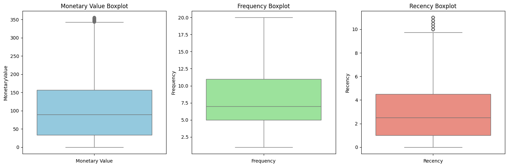
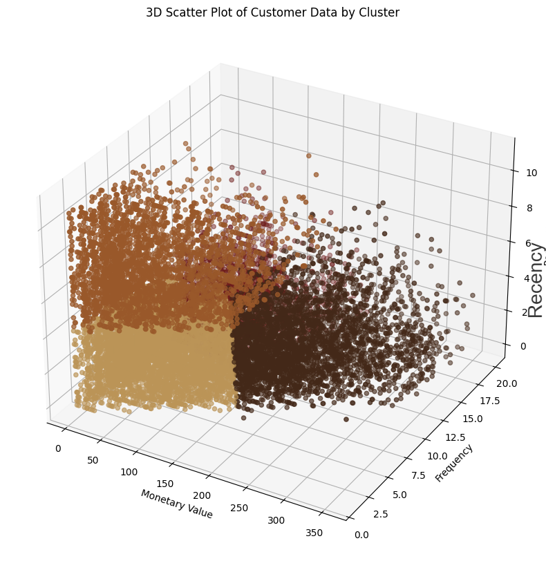
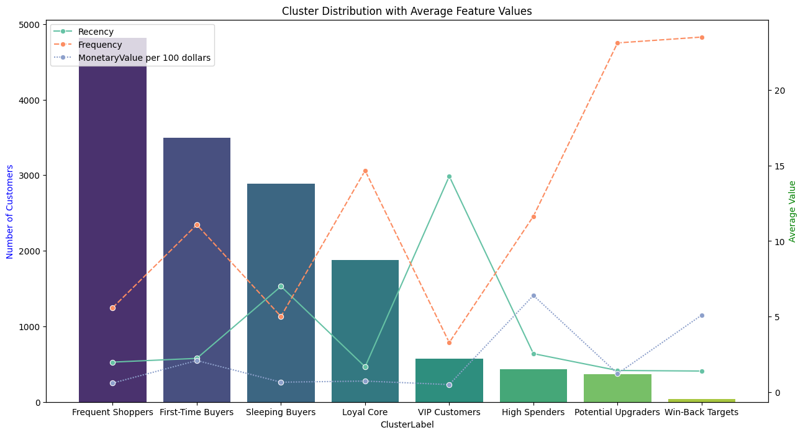

# Café Rewards program RFM Segmentation and Clustering  - Technical Documentation

## Table of Contents

1. [Introduction](#introduction)
2. [Why Conduct a Segmentation?](#why-conduct-a-segmentation)
3. [Methodology](#methodology)
4. [Achieved](#achieved)
5. [Dataset Summary](#dataset-summary)
6. [Process Phase](#process-phase)
7. [K Means Clustering](#k-means-clustering)
8. [Outlier Cluster Assignment](#outlier-cluster-assignment)
9. [Combining Core and Outlier Clusters](#combining-core-and-outlier-clusters)
10. [Cluster Summary Visualization](#cluster-summary-visualization)
11. [References](#references)

## Introduction
[(Back to Table of Contents)](#table-of-contents)

Customer segmentation allows organizations to divide a market into subsets of customers that have, or are perceived to have, common needs, interests, and priorities – then design and implement strategies targeted toward them. An essential tool, segmentation helps organizations serve low-income markets by understanding important common characteristics of their customer base, which can make the difference 


When you begin to divide a market by key customer characteristics, big differences in customer value reveal themselves


## Why Conduct a Segmentation?

[(Back to Table of Contents)](#table-of-contents)

Customer segmentation can help you divide a diverse market into a number of smaller, more homogeneous markets based on one or more meaningful characteristics. Segmentation helps you better understand your customers and their various needs and wants.

>  "When you engage with your customers and are open with them, you earn their trust, they give you feedback, and you can establish an iterative process for co-innovation.” – *Director of Consumer Insights, Unilever*
> 
 You may be surprised to hear the variety of opinions your customers have about your organization and your offerings. In essence, this is the goal of consumer insights  to understand the “voice of the customer.”

Transaction and sales data may be interesting for trend analysis, but it won’t tell you why your customers behave certain ways or what they may do in the future.

Above all, customer segmentation and research allows your organization to improve the value proposition and experiences you offer customers through a better understanding of their actual needs and desires

> “Any customer can have a car painted any color that he wants, so long as it is black.” – Henry Ford, 1908

Henry Ford’s bold statement was accurate; his product was so revolutionary that customer segmentation was not initially important. But as the market matured, it was time to identify market segments and start adjusting product to the needs of various users.

Cars with extra space and greater durability were built for farmworkers. More luxurious models were designed for those seeking prestige. Fast forward to today and consider the many models now available to meet the market’s diverse needs and preferences.
 
## Methodology
[(Back to Table of Contents)](#table-of-contents)

This section describes the  approach for RFM Segmentation and Clustering Analysis 
- Data Preparation
- Exploratory Data Analysis
- Outlier Handling
- Feature Scaling
- K-Means Clustering
- Cluster Profiling
- Outlier Cluster Analysis
- Full Customer Segmentation
- Data Export and Integration

In K-Means Clustering  and Cluster Profiling

Used the Elbow Method (inertia plot) and Silhouette Score to determine the best number of clusters (`k`). Silhouette analysis evaluates the quality of clusters

Found that **k=4** was optimal, balancing compactness and cluster separation.

**Clustering Execution:** I Ran K-Means with `k=4` on the scaled data and assigned cluster labels to each customer.
In Generating **RFM Table Construction** I aggregated customer transactions to compute:
- **Recency:** Days since last purchase.
- **Frequency:** Number of transactions.
- **Monetary Value:** Total spend.
This Attributes  encapsulate essential customer behavior patterns. 

Here is a detailed [*Technical Documentation of  RFM Segmentation and Clustering Scripts*](Scripts/Maven_cafe_analysis.ipynb)

## Achieved
[(Back to Table of Contents)](#table-of-contents)

**Customer Segments:** Identified clear, actionable customer segments for targeted marketing and retention strategies.

**Outlier Handling:** Outliers were systematically detected, labeled, and analyzed, ensuring robust segmentation.

**Cluster Quality:** Used both inertia and silhouette metrics to ensure clusters are meaningful and well-separated.

**Business Actions:** Provided tailored recommendations for each segment (e.g., VIP programs for Champions, win-back campaigns for Slipping Away).
## Dataset summary
[(Back to Table of Contents)](#table-of-contents)

This project analyzed the Café Rewards dataset, which combines [three CSV files](Data) ....capturing customers,  events, and offers into a single dataset using Excel. The combined dataset covers a 30-day promotional test period involving  involving 17k unique existing rewards members. The dataset includes demographic information such as age, income, gender, and date of membership, along with detailed records of offer events (sent, viewed, completed) and customer transactions. After removing 2,175 entries with missing demographic data (notably age recorded as 118 and null gender/income), the cleaned dataset consisted of 14,825 customer records and their associated offer interactions. To facilitate customer profiling, age and income were grouped into defined segments. 
### Data Integrity and Credibility:
The dataset has limitations, including the removal of 2,175 entries due to missing or implausible demographic data, which may introduce sampling bias. Additionally, while the dataset covers 17,000 rewards members, the analysis period is limited to 30 days, which may not fully capture longer-term customer behavior trends. These factors raise concerns about the dataset’s representativeness of the broader customer base. Therefore, the analysis adopts an operational focus, providing insights and recommendations tailored to the observed test period while acknowledging potential data constraints

## Process Phase
[(Back to Table of Contents)](#table-of-contents)

For this segmentation and clustering , I will be primarily using Python and Jupyter Notebook due to ease of use, amount of data to be processed, easier documentation . Python’s libraries (like pandas, scikit-learn, and matplotlib) provide an efficient, flexible environment for building and validating the clustering models and visualizations  to share results

### Installing packages and opening libraries
Let’s start by importing the necessary libraries for data manipulation, visualization, and clustering, and set up pandas display options for clearer output.

```python
import pandas as pd
import matplotlib.pyplot as plt
import seaborn as sns

from sklearn.cluster import KMeans
from sklearn.metrics import silhouette_score
from sklearn.preprocessing import StandardScaler

# Make numbers easier to read
pd.options.display.float_format = '{:20.2f}'.format

# Show all columns in DataFrame outputs
pd.set_option('display.max_columns', 999)
```

### Loading the Dataset

Here, I load the CSV file into a DataFrame, create a copy for analysis, and checked for duplicate rows in the data.

```python
# Load CSVs
df = pd.read_csv(r"\Data\maven_cafe.csv", low_memory=False)
```
```python
maven_cafe = df.copy()
```
```python
print("Duplicates in df:", maven_cafe.duplicated().sum())
```

### Creating the RFM Table

I first filtered the dataset to include only transaction events. Then, I calculated each customer’s Recency, Frequency, and Monetary Value by aggregating their transactions. Recency is computed as the difference between the latest transaction day and the customer’s last purchase.

```python
# Filter only transaction events
df_transactions = maven_cafe[maven_cafe['event'] == 'transaction']

# Get latest day in the dataset
latest_day = df_transactions['time_in_days'].max()

# Aggregate RFM
rfm_df = df_transactions.groupby('customer_id', as_index=False).agg(
    MonetaryValue=('Amount', 'sum'),
    Frequency=('time_in_days', 'count'),  # or .size()
    LastPurchase=('time_in_days', 'max')
)

# Calculate Recency
rfm_df['Recency'] = latest_day - rfm_df['LastPurchase']

# Optional: Drop LastPurchase if you don’t need it
rfm_df.drop(columns='LastPurchase', inplace=True)

rfm_df.head()
```

### Visualizing RFM Distributions

I plotted histograms to understand the distributions of Monetary Value, Frequency, and Recency across customers.
```python
plt.figure(figsize=(15, 5))

plt.subplot(1, 3, 1)
plt.hist(rfm_df['MonetaryValue'], bins=10, color='skyblue', edgecolor='black')
plt.title('Monetary Value Distribution')
plt.xlabel('Monetary Value')
plt.ylabel('Count')

plt.subplot(1, 3, 2)
plt.hist(rfm_df['Frequency'], bins=10, color='lightgreen', edgecolor='black')
plt.title('Frequency Distribution')
plt.xlabel('Frequency')
plt.ylabel('Count')

plt.subplot(1, 3, 3)
plt.hist(rfm_df['Recency'], bins=20, color='salmon', edgecolor='black')
plt.title('Recency Distribution')
plt.xlabel('Recency')
plt.ylabel('Count')

plt.tight_layout()
plt.show()
```

**Visualization:**


To be rigorous on outlier detection I used seaborn boxplots
### Visualizing Outliers with Boxplots

I used boxplots to quickly identify outliers in Monetary Value, Frequency, and Recency across customers.

```python
plt.figure(figsize=(15, 5))

plt.subplot(1, 3, 1)
sns.boxplot(data=rfm_df['MonetaryValue'], color='skyblue')
plt.title('Monetary Value Boxplot')
plt.xlabel('Monetary Value')

plt.subplot(1, 3, 2)
sns.boxplot(data=rfm_df['Frequency'], color='lightgreen')
plt.title('Frequency Boxplot')
plt.xlabel('Frequency')

plt.subplot(1, 3, 3)
sns.boxplot(data=rfm_df['Recency'], color='salmon')
plt.title('Recency Boxplot')
plt.xlabel('Recency')

plt.tight_layout()
plt.show()
```
**Visualization:**


From RFM boxplots it reveals that  significant skewness and outlier presence across all three dimensions:

Monetary Value shows a heavy right skew, indicating a small cohort of high-spending customers significantly inflates the average. These outliers represent high-value individuals crucial for revenue concentration.

Frequency exhibits moderate skewness, with most customers purchasing infrequently, but a distinct tail of highly engaged repeat buyers — ideal targets for loyalty strategies.

Recency is left-skewed (lower is better), suggesting the majority of users are recently active, though a visible subset appears dormant, indicating potential churn.

### Identifying Monetary Outliers

Calculated the IQR for Monetary Value and filter out customers whose values fall outside the typical range, labeling them as outliers

```python
M_Q1 = rfm_df["MonetaryValue"].quantile(0.25)
M_Q3 = rfm_df["MonetaryValue"].quantile(0.75)
M_IQR = M_Q3 - M_Q1

monetary_outliers_df = rfm_df[(rfm_df["MonetaryValue"] > (M_Q3 + 1.5 * M_IQR)) | (rfm_df["MonetaryValue"] < (M_Q1 - 1.5 * M_IQR))].copy()

monetary_outliers_df.describe()
```

### Identifying Frequency Outliers

Calculated the IQR for Frequency and filter out customers with unusually high or low values, marking them as outliers.

```python
F_Q1 = rfm_df['Frequency'].quantile(0.25)
F_Q3 = rfm_df['Frequency'].quantile(0.75)
F_IQR = F_Q3 - F_Q1

frequency_outliers_df = rfm_df[(rfm_df['Frequency'] > (F_Q3 + 1.5 * F_IQR)) | (rfm_df['Frequency'] < (F_Q1 - 1.5 * F_IQR))].copy()

frequency_outliers_df.describe()
```
### Identifying Recency Outliers

Calculated the IQR for Recency and filter out customers with unusually high or low values, marking them as outliers.

```python
F_Q1 = rfm_df['Recency'].quantile(0.25)
F_Q3 = rfm_df['Recency'].quantile(0.75)
F_IQR = F_Q3 - F_Q1

recency_outliers_df = rfm_df[(rfm_df['Recency'] > (F_Q3 + 1.5 * F_IQR)) | (rfm_df['Recency'] < (F_Q1 - 1.5 * F_IQR))].copy()

recency_outliers_df.describe()
```
### Filtering Non-Outliers
 I created a dataset excluding customers flagged as outliers in Monetary, Frequency, or Recency.

```python
non_outliers_df = rfm_df[
    (~rfm_df.index.isin(monetary_outliers_df.index)) &
    (~rfm_df.index.isin(frequency_outliers_df.index)) &
    (~rfm_df.index.isin(recency_outliers_df.index))
]
non_outliers_df.describe()
```

<div>
<style scoped>
    .dataframe tbody tr th:only-of-type {
        vertical-align: middle;
    }

    .dataframe tbody tr th {
        vertical-align: top;
    }

    .dataframe thead th {
        text-align: right;
    }
</style>
<table border="1" class="dataframe">
  <thead>
    <tr style="text-align: right;">
      <th></th>
      <th>MonetaryValue</th>
      <th>Frequency</th>
      <th>Recency</th>
    </tr>
  </thead>
  <tbody>
    <tr>
      <th>count</th>
      <td>13084.00</td>
      <td>13084.00</td>
      <td>13084.00</td>
    </tr>
    <tr>
      <th>mean</th>
      <td>104.25</td>
      <td>8.24</td>
      <td>3.13</td>
    </tr>
    <tr>
      <th>std</th>
      <td>80.27</td>
      <td>4.42</td>
      <td>2.59</td>
    </tr>
    <tr>
      <th>min</th>
      <td>0.15</td>
      <td>1.00</td>
      <td>0.00</td>
    </tr>
    <tr>
      <th>25%</th>
      <td>33.14</td>
      <td>5.00</td>
      <td>1.00</td>
    </tr>
    <tr>
      <th>50%</th>
      <td>89.34</td>
      <td>7.00</td>
      <td>2.50</td>
    </tr>
    <tr>
      <th>75%</th>
      <td>157.29</td>
      <td>11.00</td>
      <td>4.50</td>
    </tr>
    <tr>
      <th>max</th>
      <td>355.49</td>
      <td>20.00</td>
      <td>11.00</td>
    </tr>
  </tbody>
</table>
</div>

Analysis shows that customer spending (MonetaryValue) is generally healthy, with most falling between $33.14 and $157.29, a median of $89.34, and only a mild right skew no extreme outliers or need for transformation. Purchase Frequency also looks solid: the median is 7 purchases, mean is 8.24, and high-frequency buyers (11+) likely represent VIPs worth retaining. Recency trends are exceptional: most customers purchased within 4.5 days (median 2.5, mean 3.13), and even the longest gap is only 11 days, indicating strong engagement.
### Boxplots To show Above Findings After Removing Outliers
Used `matplotlib` and `seaborn` on the cleaned dataset to plot boxplots again  this time to confirm that outliers are gone and distributions look more balanced for Monetary Value, Frequency, and Recency  

```python
plt.figure(figsize=(15, 5))

plt.subplot(1, 3, 1)
sns.boxplot(data=non_outliers_df['MonetaryValue'], color='skyblue')
plt.title('Monetary Value Boxplot')
plt.xlabel('Monetary Value')

plt.subplot(1, 3, 2)
sns.boxplot(data=non_outliers_df['Frequency'], color='lightgreen')
plt.title('Frequency Boxplot')
plt.xlabel('Frequency')

plt.subplot(1, 3, 3)
sns.boxplot(data=non_outliers_df['Recency'], color='salmon')
plt.title('Recency Boxplot')
plt.xlabel('Recency')

plt.tight_layout()
plt.show()
```

**Visualization:**




The boxplots show strong results: Monetary Value outliers above ~$350 are much reduced, with a balanced spread centered around $90 far better than the extreme values seen earlier. Frequency looks very clean with no visible outliers, maxing out around 20 and clustering between 5–12 purchases. Recency still has a few outliers above 10, but most customers purchased within 0–5 days; I can tighten the outlier boundary further but lets leave it that way. Overall, distributions look solid and well-prepared for analysis.

### 3D Scatter Plot of Non-Outlier Customers

I Created a 3D scatter plot to visualize the relationship between Monetary Value, Frequency, and Recency for customers without outliers.

```python
fig = plt.figure(figsize=(8, 8))

ax = fig.add_subplot(projection="3d")

scatter = ax.scatter(non_outliers_df["MonetaryValue"], non_outliers_df["Frequency"], non_outliers_df["Recency"])

ax.set_xlabel('Monetary Value')
ax.set_ylabel('Frequency')
ax.set_zlabel('Recency')

ax.set_title('3D Scatter Plot of Customer Data')

plt.show()
```
**Visualization:**


Standard scaling adjusts your data so each feature has a mean of 0 and a standard deviation of 1, using the formula z = (x - μ) / σ. This makes sure every feature contributes equally to the analysis by normalizing differences in scale. As a caveat this assumes that our data is normally distribution but it's a fair enough assumption

### Scaling Data

Below is how I used `StandardScaler` to normalize the Monetary Value, Frequency, and Recency variables so they are on the same scale for clustering

```python
scaler = StandardScaler()

scaled_data = scaler.fit_transform(non_outliers_df[["MonetaryValue", "Frequency", "Recency"]])

scaled_data
```

The above  is in numpy array but I'm going to make data easy to deal by converting to data frame

### Creating Scaled DataFrame

So, I converted the scaled data into a DataFrame with the original indices and column names for easier use in clustering.

```python
scaled_data_df = pd.DataFrame(scaled_data, index=non_outliers_df.index, columns=("MonetaryValue", "Frequency", "Recency"))

scaled_data_df
```

### 3D Scatter Plot of Scaled Customer Data

I plotted the scaled data in 3D to visualize patterns and potential clusters in Monetary Value, Frequency, and Recency.

```python
fig = plt.figure(figsize=(8, 8))

ax = fig.add_subplot(projection="3d")

scatter = ax.scatter(scaled_data_df["MonetaryValue"], scaled_data_df["Frequency"], scaled_data_df["Recency"])

ax.set_xlabel('Monetary Value')
ax.set_ylabel('Frequency')
ax.set_zlabel('Recency')

ax.set_title('3D Scatter Plot of Customer Data')

plt.show()
```
**Visualization:**


## K means clustering
[(Back to Table of Contents)](#table-of-contents)

To determine how many clusters we're going to use elbow method to determine no. of clusters

```python
max_k = 12

inertia = []
silhoutte_scores = []
k_values = range(2, max_k + 1)

for k in k_values:

    kmeans = KMeans(n_clusters=k, random_state=42, max_iter=1000)

    cluster_labels = kmeans.fit_predict(scaled_data_df)

    sil_score = silhouette_score(scaled_data_df, cluster_labels)

    silhoutte_scores.append(sil_score)

    inertia.append(kmeans.inertia_)

plt.figure(figsize=(14, 6))

plt.subplot(1, 2, 1)
plt.plot(k_values, inertia, marker='o')
plt.title('KMeans Inertia for Different Values of k')
plt.xlabel('Number of Clusters (k)')
plt.ylabel('Inertia')
plt.xticks(k_values)
plt.grid(True)

plt.subplot(1, 2, 2)
plt.plot(k_values, silhoutte_scores, marker='o', color='orange')
plt.title('Silhouette Scores for Different Values of k')
plt.xlabel('Number of Clusters (k)')
plt.ylabel('Silhouette Score')
plt.xticks(k_values)
plt.grid(True)

plt.tight_layout()
plt.show()
```
**Visualization:**


### Finding Optimal Number of Clusters

This is how  I plotted inertia and silhouette scores across different values of _k_ to help determine the best number of clusters for K-Means.

```python
import numpy as np

# Prepare a summary DataFrame for the optimal k selection metrics
summary_df = pd.DataFrame({
    'k': list(k_values),
    'Inertia': [int(round(val)) for val in inertia],
    'Silhouette': [round(val, 2) for val in silhoutte_scores]
})

# Format numbers for display
summary_df['Inertia'] = summary_df['Inertia'].apply(lambda x: f"{x:,}")

# Pivot for pretty printing
summary_df_display = summary_df.set_index('k').T
summary_df_display.index = ['Inertia', 'Silhouette']
summary_df_display.columns = [f'k={k}' for k in summary_df_display.columns]

print("Example Output (Optimal k):")
display(summary_df_display)
```

### Cluster Analysis Summary

Here’s the formatted table showing inertia and silhouette scores across values of _k_ to help determine the optimal cluster count.

<div>
<style scoped>
    .dataframe tbody tr th:only-of-type {
        vertical-align: middle;
    }

    .dataframe tbody tr th {
        vertical-align: top;
    }

    .dataframe thead th {
        text-align: right;
    }
</style>
<table border="1" class="dataframe">
  <thead>
    <tr style="text-align: right;">
      <th></th>
      <th>k=2</th>
      <th>k=3</th>
      <th>k=4</th>
      <th>k=5</th>
      <th>k=6</th>
      <th>k=7</th>
      <th>k=8</th>
      <th>k=9</th>
      <th>k=10</th>
      <th>k=11</th>
      <th>k=12</th>
    </tr>
  </thead>
  <tbody>
    <tr>
      <th>Inertia</th>
      <td>24,493</td>
      <td>17,874</td>
      <td>13,842</td>
      <td>11,655</td>
      <td>10,262</td>
      <td>9,628</td>
      <td>8,872</td>
      <td>7,839</td>
      <td>7,307</td>
      <td>6,838</td>
      <td>6,398</td>
    </tr>
    <tr>
      <th>Silhouette</th>
      <td>0.33</td>
      <td>0.32</td>
      <td>0.34</td>
      <td>0.32</td>
      <td>0.32</td>
      <td>0.30</td>
      <td>0.28</td>
      <td>0.28</td>
      <td>0.28</td>
      <td>0.27</td>
      <td>0.28</td>
    </tr>
  </tbody>
</table>
</div>


In cluster evaluation, inertia measures how tightly data points fit within clusters ,a lower is better. Inertia drops sharply from k=2 (24,493) to k=4 (13,842), then levels off, with the elbow suggesting diminishing returns beyond k=4 or k=5. Meanwhile, silhouette scores (ranging -1 to 1) measure cluster separation; higher is better. The highest silhouette score (0.34) occurs at k=4, with slight declines after. Combining both metrics, k=4 is optimal, providing the best trade-off between compact clusters (low inertia) and well-separated clusters (highest silhouette score).

### Running K-Means Clustering

Fitted a K-Means model with 4 clusters and assign each customer a cluster label.

```python
kmeans = KMeans(n_clusters=4, random_state=42, max_iter=1000)

cluster_labels = kmeans.fit_predict(scaled_data_df)

cluster_labels
```

### Final Clustered Data

Added the cluster labels to our non-outlier customer data for further analysis and visualization.

```python
non_outliers_df["Cluster"] = cluster_labels

non_outliers_df
```

### 3D Cluster Visualization of Customer Segments

I applied K-Means clustering to scaled customer RFM data (Recency, Frequency, Monetary) and assigned each customer to one of 4 distinct segments. Then, I visualized these segments using a **3D scatter plot** where each cluster was represented with a unique solid color. 
```python
cluster_colors = {0: '#6f1d1b', 
                  1: '#99582a', 
                  2: '#432818',  
                  3: '#bb9457'}  

colors = non_outliers_df['Cluster'].map(cluster_colors)

fig = plt.figure(figsize=(10, 10))
ax = fig.add_subplot(projection='3d')

scatter = ax.scatter(non_outliers_df['MonetaryValue'], 
                     non_outliers_df['Frequency'], 
                     non_outliers_df['Recency'], 
                     c=colors,  # Use mapped solid colors
                     marker='o')

ax.set_xlabel('Monetary Value')
ax.set_ylabel('Frequency')
ax.set_zlabel('Recency')

ax.set_title('3D Scatter Plot of Customer Data by Cluster')

plt.show()
```
The plot provides a clear view of how customer groups differ across purchasing behavior.




There are four clusters and because it's invisible from the 3D scatter plot I decided to create an interactive 3D scatter plot

### Interactive 3D Cluster Plot

I created an interactive 3D scatter plot using Plotly, showing customer clusters with distinct colors and hover details for deeper exploration of customer segments.

```python
import plotly.express as px

# Convert cluster_colors keys to strings for plotly compatibility
color_discrete_map = {str(k): v for k, v in cluster_colors.items()}

fig = px.scatter_3d(
    non_outliers_df,
    x="MonetaryValue",
    y="Frequency",
    z="Recency",
    color="Cluster",
    color_discrete_map=color_discrete_map,
    hover_data=["customer_id", "MonetaryValue", "Frequency", "Recency"],
    title="Interactive 3D Scatter Plot of Customer Data by Cluster"
)
fig.update_traces(marker=dict(size=5))
fig.show()

```

###  Cluster Metric Distributions

I created violin plots to compare the distributions of **Monetary Value**, **Frequency**, and **Recency** across clusters, helping visualize how each metric varies among customer segments.
```python
plt.figure(figsize=(12, 18))

plt.subplot(3, 1, 1)
sns.violinplot(x=non_outliers_df['Cluster'], y=non_outliers_df['MonetaryValue'], palette=cluster_colors, hue=non_outliers_df["Cluster"])
sns.violinplot(y=non_outliers_df['MonetaryValue'], color='gray', linewidth=1.0)
plt.title('Monetary Value by Cluster')
plt.ylabel('Monetary Value')

plt.subplot(3, 1, 2)
sns.violinplot(x=non_outliers_df['Cluster'], y=non_outliers_df['Frequency'], palette=cluster_colors, hue=non_outliers_df["Cluster"])
sns.violinplot(y=non_outliers_df['Frequency'], color='gray', linewidth=1.0)
plt.title('Frequency by Cluster')
plt.ylabel('Frequency')


plt.subplot(3, 1, 3)
sns.violinplot(x=non_outliers_df['Cluster'], y=non_outliers_df['Recency'], palette=cluster_colors, hue=non_outliers_df["Cluster"])
sns.violinplot(y=non_outliers_df['Recency'], color='gray', linewidth=1.0)
plt.title('Recency by Cluster')
plt.ylabel('Recency')

plt.tight_layout()
plt.show()
```

**Visualization:**


And from above Clusters reveal distinct customer profiles: **Champions** purchase often, spend more, and are recently active; prioritize them with VIP perks and personalized engagement. **Slipping Away** customers buy infrequently, spend little, and haven't purchased recently; target them with win-back offers and feedback requests. **Potential Loyalists** show recent activity, solid spend, and moderate frequency; nurture them with loyalty rewards, upselling, and personalized experiences. **New & Low-Engaged** customers have made recent but low-spend, low-frequency purchases; focus on onboarding, welcome offers, and educational content. Violin plots of Monetary, Frequency, and Recency confirm these patterns: high-value clusters stand out with wider distributions in spend and frequency, while recent activity clusters show low recency. Use these insights to tailor campaigns by customer profile.

### Outlier Cluster Assignment

[(Back to Table of Contents)](#table-of-contents)

This code is labeling outliers into distinct custom groups (clusters) based on whether they are outliers in Monetary, Frequency, or Recency, or some combination  and combining them all into a single DataFrame

```python
overlap_indices = monetary_outliers_df.index.intersection(frequency_outliers_df.index)
recency_overlap_indices = recency_outliers_df.index.intersection(monetary_outliers_df.index.union(frequency_outliers_df.index))

monetary_only_outliers = monetary_outliers_df.drop(overlap_indices)
frequency_only_outliers = frequency_outliers_df.drop(overlap_indices)
recency_only_outliers = recency_outliers_df.drop(recency_overlap_indices)
monetary_and_frequency_outliers = monetary_outliers_df.loc[overlap_indices]

monetary_only_outliers["Cluster"] = -1
frequency_only_outliers["Cluster"] = -2
recency_only_outliers["Cluster"] = -3
monetary_and_frequency_outliers["Cluster"] = -4

outlier_clusters_df = pd.concat([monetary_only_outliers, frequency_only_outliers,recency_only_outliers, monetary_and_frequency_outliers])

outlier_clusters_df
```

### Outlier Overlap Analysis

I calculated and reported the number and percentage of customers appearing as outliers in multiple RFM metrics, helping clarify overlaps across outlier groups.

```python
# Total number of outliers (from outlier_clusters_df)
total_outliers = len(outlier_clusters_df)

# Overlap counts
monetary_frequency_overlap = 35
monetary_recency_overlap = 4
frequency_recency_overlap = 0

# Calculate percentages
mf_pct = (monetary_frequency_overlap / total_outliers) * 100
mr_pct = (monetary_recency_overlap / total_outliers) * 100
fr_pct = (frequency_recency_overlap / total_outliers) * 100

print(f"Monetary & Frequency overlap: {monetary_frequency_overlap} ({mf_pct:.2f}%)")
print(f"Monetary & Recency overlap: {monetary_recency_overlap} ({mr_pct:.2f}%)")
print(f"Frequency & Recency overlap: {frequency_recency_overlap} ({fr_pct:.2f}%)")
print(f"Total outliers: {total_outliers}")
```

- Monetary & Frequency overlap: 35 (2.49%)
- Monetary & Recency overlap: 4 (0.28%)
- Frequency & Recency overlap: 0 (0.00%)
- Total outliers: 1408

There is some overlap between outlier groups: 35 customers (2.48%) are outliers in both monetary value and frequency, 4 (0.28%) overlap in monetary and recency, and none in frequency and recency. Overall, outlier overlaps are minimal, indicating that most outliers are unique to one metric. This suggests targeted strategies can focus on specific behaviors (spending, frequency, or recency) rather than needing broad approaches for multi-metric extremes.

### Outlier Cluster Breakdown

I checked the total and unique outlier records and counted how many customers belong to each outlier cluster type based on the assigned cluster labels.

```python
print("Total outlier records:", outlier_clusters_df.shape[0])
print("Unique records:", outlier_clusters_df.index.nunique())
```
```python
outlier_clusters_df["Cluster"].value_counts()

```

### Visualizing Outlier Clusters

I created violin plots to compare the distributions of Monetary Value, Frequency, and Recency across the different outlier clusters.

```python
cluster_colors = {-1: '#9467bd',
                  -2: '#8c564b',
                  -3: '#e377c2',
                  -4: '#6f1d1b'}

plt.figure(figsize=(12, 18))

plt.subplot(3, 1, 1)
sns.violinplot(x=outlier_clusters_df['Cluster'], y=outlier_clusters_df['MonetaryValue'], palette=cluster_colors, hue=outlier_clusters_df["Cluster"])
sns.violinplot(y=outlier_clusters_df['MonetaryValue'], color='gray', linewidth=1.0)
plt.title('Monetary Value by Cluster')
plt.ylabel('Monetary Value')

plt.subplot(3, 1, 2)
sns.violinplot(x=outlier_clusters_df['Cluster'], y=outlier_clusters_df['Frequency'], palette=cluster_colors, hue=outlier_clusters_df["Cluster"])
sns.violinplot(y=outlier_clusters_df['Frequency'], color='gray', linewidth=1.0)
plt.title('Frequency by Cluster')
plt.ylabel('Frequency')

plt.subplot(3, 1, 3)
sns.violinplot(x=outlier_clusters_df['Cluster'], y=outlier_clusters_df['Recency'], palette=cluster_colors, hue=outlier_clusters_df["Cluster"])
sns.violinplot(y=outlier_clusters_df['Recency'], color='gray', linewidth=1.0)
plt.title('Recency by Cluster')
plt.ylabel('Recency')

plt.tight_layout()
plt.show()
```
**Visualization:**


From above plots Cluster -4 (DELIGHT) are top-tier customers with the highest spend, very frequent purchases, and recent activity; focus on VIP programs, surprise gifts, early access, and concierge service to keep them loyal. Cluster -3 (RE-ENGAGE) barely buy, spend little, and haven’t purchased recently; use win-back campaigns, strong incentives, and feedback requests. Cluster -2 (UPSELL) buy often and recently but spend little; target them with bundles, loyalty tiers, and premium add-ons. Cluster -1 (PAMPER) spend a lot, buy less frequently but recently; nurture them with personalized offers, luxury treatment, and exclusive events.

### Combining Core and Outlier Clusters
[(Back to Table of Contents)](#table-of-contents)

I combined the non-outlier clusters with the outlier clusters into one dataset for a complete view of customer segmentation.

```python
full_clustering_df = pd.concat([non_outliers_df, outlier_clusters_df])

full_clustering_df
```

### Adding Cluster Labels

I assigned descriptive labels to each cluster in your dataset for easier interpretation and analysis.

```python
cluster_labels = {
    0: "Loyal Core",             
    1: "Sleeping Buyers",        
    2: "First-Time Buyers",      
    3: "Frequent Shoppers",      
    -1: "High Spenders",         
    -2: "Potential Upgraders",   
    -3: "VIP Customers",         
    -4: "Win-Back Targets"       
}
```

```python
full_clustering_df["ClusterLabel"] = full_clustering_df["Cluster"].map(cluster_labels)

full_clustering_df
```

## Cluster Summary Visualization
[(Back to Table of Contents)](#table-of-contents)

I created a bar and line chart to compare the size of each cluster and their average feature values.

```python
cluster_counts = full_clustering_df['ClusterLabel'].value_counts()
full_clustering_df["MonetaryValue per 100 dollars"] = full_clustering_df["MonetaryValue"] / 100.00
feature_means = full_clustering_df.groupby('ClusterLabel')[['Recency', 'Frequency', 'MonetaryValue per 100 dollars']].mean()

fig, ax1 = plt.subplots(figsize=(15, 8))

sns.barplot(x=cluster_counts.index, y=cluster_counts.values, ax=ax1, palette='viridis', hue=cluster_counts.index)
ax1.set_ylabel('Number of Customers', color='b')
ax1.set_title('Cluster Distribution with Average Feature Values')

ax2 = ax1.twinx()

sns.lineplot(data=feature_means, ax=ax2, palette='Set2', marker='o')
ax2.set_ylabel('Average Value', color='g')

plt.show()
```

**Visualization:**




The graph above combines a bar plot and line plot to summarize customer clusters:

- **Bar Plot:** Shows the number of customers in each cluster (segment), helping you see which segments are largest or smallest.
- **Line Plot:** Overlays the average values of Recency, Frequency, and Monetary Value (per £100) for each cluster, illustrating how customer behavior differs by segment.
**Interpretation:**

- Taller bars indicate more customers in that segment.
- The line plot reveals which clusters have higher spenders, more frequent buyers, or more recent activity.
- Together, these visuals help identify high-value segments, potential targets for retention, and areas for marketing focus.
- Frequent Shoppers have the largest count but lower spend and moderate frequency. First-Time Buyers are also large, with higher frequency. High Spenders and Potential Upgraders are small in size but have much higher spending. VIP Customers and Win-Back Targets have the fewest customers and distinct profiles, like high average recency for VIPs. Overall, clusters differ in size and behavior, indicating the need for tailored marketing strategies.

## References
[(Back to Table of Contents)](#table-of-contents)

- S. H. Shihab, S. Afroge, and S. Z. Mishu, “Rfm based market segmentation approach using advanced k-means and agglomerative clustering: a comparative study,” in 2019 International conference on electrical, computer and communication engineering (ECCE). IEEE, 2019, pp. 1–4.
- J. Zhou, J. Wei, and B. Xu, “Customer segmentation by web content mining,” Journal of Retailing and Consumer Services, vol. 61, p. 102588, 2021.
-  D. Vakratsas and F. M. Bass, “The relationship between purchase regularity and propensity to accelerate,” Journal of Retailing, vol. 78, no. 2, pp. 119–129, 2002.
- A. J. Christy, A. Umamakeswari, L. Priyatharsini, and A. Neyaa, “Rfm ranking an effective approach to customer segmentation,” Journal of King Saud University-Computer and Information Sci- ences, vol. 33, no. 10, pp. 1251–1257, 2021.
- M. Y. Smaili and H. Hachimi, “New rfm-d classification model for improving customer analysis and response prediction,” Ain Shams Engineering Journal, vol. 14, no. 12, p. 102254, 2023.
- A. Ullah, M. I. Mohmand, H. Hussain, S. Johar, I. Khan, S. Ahmad, H. A. Mahmoud, and S. Huda, “Customer analysis using machine learning-based classification algorithms for effective segmentation using recency, frequency, monetary, and time,” sensors, vol. 23, no. 6, p. 3180, 2023.
- X. He and C. Li, “The research and application of customer segmentation on e-commerce websites,” in 2016 6th International Conference on Digital Home (ICDH). IEEE, 2016, pp. 203–208.
- R. Gustriansyah, N. Suhandi, and F. Antony, “Clustering optimiza- tion in rfm analysis based on k-means,” Indonesian Journal of Electrical Engineering and Computer Science, vol. 18, no. 1, pp. 470–477, 2020.
- S. Idowu, A. Annam, E. Rangarajan, and S. Kattukottai, “Customer segmentation based on rfm model using k-means, hierarchical and fuzzy c-means clustering algorithms,” Jerarchical y Fuzzy C-Means, August 2019, 2019.
- C. Subbalakshmi, G. R. Krishna, S. K. M. Rao, and P. V. Rao, “A method to find optimum number of clusters based on fuzzy silhouette on dynamic data set,” Procedia Computer Science, vol. 46, pp. 346–353, 2015.
- [ RFM (market research)](https://en.wikipedia.org/wiki/RFM_%28market_research%29?utm_source=chatgpt.com)
- [Enhancing customer segmentation: RFM analysis and K-Means clustering implementation](https://www.researchgate.net/publication/388515756_Enhancing_customer_segmentation_RFM_analysis_and_K-Means_clustering_implementation)